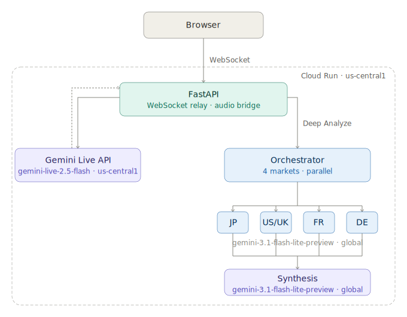
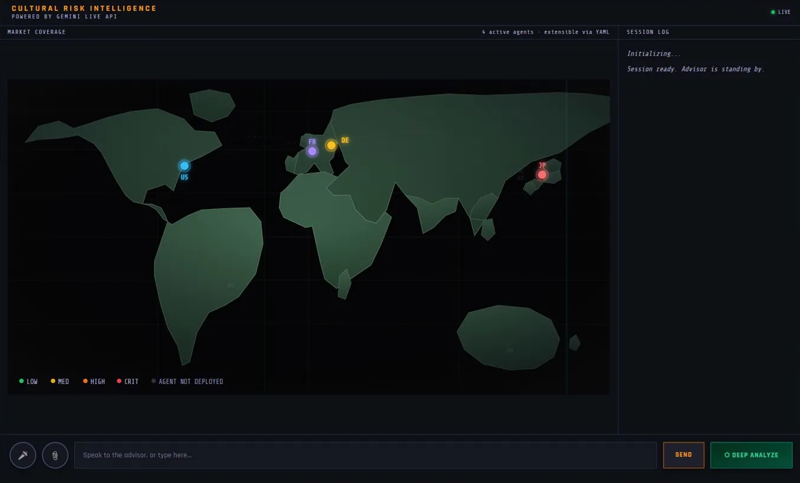

# Cultural Risk Intelligence

**Real-time voice-based cultural risk analysis for global creative teams.**

Built for the [Gemini Live Agent Challenge](https://geminiliveagentchallenge.devpost.com) · Powered by Gemini Live API · Deployed on Cloud Run

🌐 **Live Demo**: https://cultural-risk-intelligence-121466101834.us-central1.run.app

---

## What It Does

Cultural Risk Intelligence is a real-time voice agent that helps A&R teams evaluate visual content — costumes, symbols, design elements — across four global markets simultaneously.

Share an image, speak naturally, and get instant cultural risk analysis from four market personas: **Japan, US/UK, France, and Germany**. The advisor is always in the room, always listening, and can be interrupted mid-sentence — just like a real conversation.

```
"This is the costume concept — what's your read?"
→ Gemini responds with US market analysis (voice)

"Wait — is that just the US? What about every market?"
→ Gemini pivots immediately (barge-in / interruption handling)

"Can you analyze all markets at once?"
→ Voice trigger launches parallel Deep Analysis across all 4 markets
```

While the demo focuses on a costume concept, the agent works with any visual creative — album artwork, stage design, promotional imagery, music videos, brand assets. If it can be seen, it can be evaluated.

デモではコスチュームを例として使用しているが、このエージェントはあらゆるビジュアルクリエイティブに対応する——アルバムアートワーク、ステージデザイン、プロモーション画像、ミュージックビデオ、ブランドアセット。見えるものであれば、評価できる。

---

## Why This Exists

Creative decisions in global music are made fast — and cultural missteps are discovered slow.

The ideal scenario is simple: have a specialist in the room for every market. Someone who knows what a halo means in Japan, what "Stella Maris" triggers in France, what eagle motifs evoke in Germany. But that specialist doesn't exist in a single person. Assembling the right expertise for every market costs time and money that most creative teams don't have. And even when specialists are available, the knowledge stays siloed — dependent on whoever happens to be in the meeting.

There's another problem: formality. Cultural risk review tends to happen at the end of the process, as an official checkpoint. By then, the creative is locked in. What's missing is the ability to ask *casually*, at the idea stage — "Does this feel right? What am I missing?" — and get a thoughtful answer without scheduling a meeting or filing a request.

That's the gap this project fills. Not a report. Not a checklist. Not a formal review.

**A conversation. Always available. Across all markets. Simultaneously.**

---

グローバル音楽における創作的意思決定は速く、文化的ミスの発見は遅い。

理想はシンプルだ。すべての市場の専門家を会議室に揃えること。日本でハローが何を意味するか、フランスで「Stella Maris」が何を喚起するか、ドイツでワシのモチーフが何を連想させるかを知っている人物を。しかしそんな専門家は一人では存在しない。各市場に必要な専門知識を集めるには、ほとんどのクリエイティブチームが持っていない時間とコストがかかる。専門家がいたとしても、その知識は属人化する——たまたまその会議にいた人物に依存する形で。

もう一つの問題がある：フォーマリティだ。文化的リスクのレビューはプロセスの終盤、正式なチェックポイントとして行われる傾向がある。その時点ではクリエイティブはすでに固まっている。欠けているのは、アイデア段階でカジュアルに問いかける能力だ——「これは大丈夫？何か見落としていない？」と、会議を設定したりリクエストを提出したりせずに、的確な答えをもらうこと。

このプロジェクトが埋めるのはそのギャップだ。レポートではない。チェックリストでもない。正式な審査でもない。

**会話だ。いつでも使える。全市場に対して。同時に。**

---

## Architecture



| Component | Technology |
|-----------|-----------|
| Real-time voice | Gemini Live API (`gemini-live-2.5-flash-native-audio`) |
| Market agents (×4) | `gemini-3.1-flash-lite-preview` · global |
| Synthesis | `gemini-3.1-flash-lite-preview` · global |
| Backend | FastAPI + WebSocket · Python |
| Frontend | Vanilla JS · SVG world map |
| Deployment | Google Cloud Run · us-central1 |
| IaC | `infra/deploy.sh` |

---

## Key Features

- **🎙 Real-time voice conversation** — Speak naturally, get spoken responses
- **✋ Barge-in / interruption handling** — Interrupt Gemini mid-sentence, just like a real advisor
- **🖼 Image input** — Share a costume image and analyze it across markets
- **🌍 4-market parallel analysis** — JP / US/UK / FR / DE run simultaneously via Orchestrator
- **🔊 Voice trigger for Deep Analyze** — Say *"analyze all markets"* to launch parallel analysis hands-free
- **📊 Risk score visualization** — Per-market risk gauges with color-coded severity
- **🗺 Live world map** — Market pins light up as Gemini references each region
- **🔁 Persistent image context** — Image stays attached throughout the session until explicitly removed

---

## 7-Domain Analysis Framework

Developed from years of experience in the global entertainment industry:

1. **Culture & Religion** — Symbols, iconography, sacred associations
2. **Legal & Regulatory** — Local laws, IP, platform restrictions
3. **Social Psychology** — Social media virality, cancel culture patterns
4. **Expression & Design** — Color symbolism, visual grammar, material meaning
5. **Accessibility & Inclusivity** — DEI representation, minority community impact
6. **Humor & Satire** — Irony reception, cultural tone mismatch
7. **Trigger Content** — Historical trauma, political iconography, past controversy patterns

---

## Market Personas

| Market | Prompt | Key Lens |
|--------|--------|---------|
| JP | `agents/prompts/jp.yaml` | SNS炎上, Shinto/Buddhist symbolism, White garment taboo |
| US/UK | `agents/prompts/usuk.yaml` | Cancel culture, Cultural appropriation, DEI |
| FR | `agents/prompts/fr.yaml` | Laïcité, Colonial history, Charlie Hebdo context |
| DE | `agents/prompts/de.yaml` | §86a, Nazi iconography, Shitstorm culture, DSGVO |

Market agents are **prompt-driven and modular** — adding a new market requires one YAML file.

---

## Demo

[](https://youtu.be/SNurbpccRU0)

▶️ **[Watch Demo Video](https://youtu.be/SNurbpccRU0)**

Try it live: https://cultural-risk-intelligence-121466101834.us-central1.run.app

Try it live: https://cultural-risk-intelligence-121466101834.us-central1.run.app

**Suggested prompts:**
- *"This is a costume concept with a golden halo and white robes — what's your read for the US market?"*
- *"What about Japan? How does the interpretation change?"*
- *"Can you analyze all markets at once?"*

---

## Project Structure

```
cultural-risk-intelligence/
├── app/
│   ├── main.py               # FastAPI entry point
│   ├── live_session.py       # WebSocket / Gemini Live API relay
│   └── static/
│       └── index.html        # Frontend (Vanilla JS + SVG map)
├── agents/
│   ├── orchestrator.py       # Parallel analysis coordinator
│   ├── market_agents.py      # Market agents (JP / US/UK / FR / DE)
│   └── prompts/              # Per-market YAML prompts
├── docs/
│   ├── architecture.svg      # Architecture diagram
│   └── screenshots/          # App screenshots
├── infra/
│   └── deploy.sh             # Cloud Run deploy script (IaC)
├── start.sh                  # Production launcher
├── dev-start.sh              # Local dev launcher (with ADC check)
├── Dockerfile
└── requirements.txt
```

---

## Local Development

### Prerequisites

- Python 3.12+
- Google Cloud project with Vertex AI enabled
- Application Default Credentials configured

```bash
# Clone
git clone https://github.com/syam1977/cultural-risk-intelligence
cd cultural-risk-intelligence

# Install dependencies
pip install -r requirements.txt

# Configure GCP
gcloud auth application-default login
gcloud auth application-default set-quota-project YOUR_PROJECT_ID

# Start (with ADC check)
./dev-start.sh
```

Open `http://localhost:8080`

### Environment Variables

Set in `start.sh`:

```bash
GOOGLE_CLOUD_PROJECT=your-project-id
GOOGLE_CLOUD_LOCATION=global           # For Orchestrator / Market Agents
GOOGLE_CLOUD_LIVE_LOCATION=us-central1 # For Live API
```

---

## Cloud Run Deployment

```bash
# Build and deploy
bash infra/deploy.sh
```

Requires:
- Service account with `roles/aiplatform.user`
- Container Registry access

---

## Technical Notes

| Decision | Rationale |
|----------|-----------|
| `--loop asyncio` for uvicorn | uvloop conflicts with websockets library causing handshake timeouts |
| `api_version='v1beta1'` | Required for Live API WebSocket connections |
| `us-central1` for Live API | `global` location is not supported by Live API |
| `global` for Market Agents | Standard Vertex AI endpoint, supports parallelism |
| `gemini-live-2.5-flash-native-audio` | Native audio output, no TTS conversion needed |
| `gemini-3.1-flash-lite-preview` | Latest generation, lightweight, fast for parallel agents |

---

## Build Log

| Day | Focus | Status |
|-----|-------|--------|
| Day 1 | Environment setup · All model connections verified | ✅ |
| Day 2 | Voice response · Image input · Continuous conversation | ✅ |
| Day 3 | Microphone input · VAD · Barge-in / interruption | ✅ |
| Day 4 | UI design · Deep Analyze E2E · Orchestrator + 4 agents | ✅ |
| Day 5 | Cloud Run deployment · Image support in Deep Analyze | ✅ |
| Day 6 | UI redesign · World map · Risk score gauges · Transcription | ✅ |
| Day 7 | Voice trigger · Deep Analyze voice readout · Model unification | ✅ |

---

## About the Builder

Built by **Shinichi Yamada** ([@syam1977](https://github.com/syam1977)), a digital and AI practitioner with a long background in Japan's music industry. Currently leading AI initiatives at his organization.

- **3rd place** at Microsoft Build 2025 Best Instructions Contest (1st among non-US residents)

The cultural risk domains and market personas in this project reflect real editorial judgment developed over years in the global music industry.

---

## License

MIT

---

*Submitted to the [Gemini Live Agent Challenge](https://geminiliveagentchallenge.devpost.com) · March 2026*
